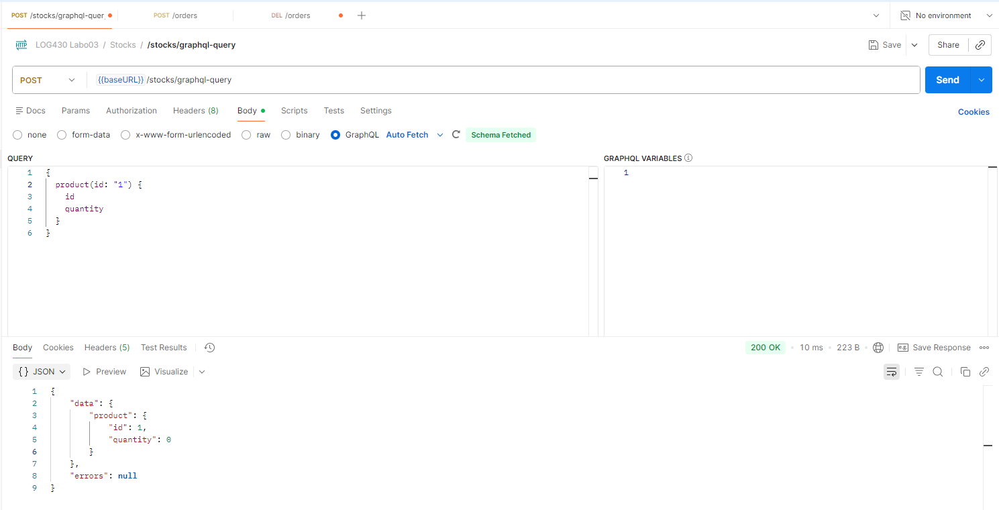

ÉTS - LOG430 - Architecture logicielle - Hiver 2026

Étudiant(e) : Denis Aspirot

# Questions

## 1. Dans la RFC 7231, nous trouvons que certaines méthodes HTTP sont considérées comme sûres (safe) ou idempotentes, en fonction de leur capacité à modifier (ou non) l'état de l'application. Lisez les sections 4.2.1 et 4.2.2 de la RFC 7231 et répondez : parmi les méthodes mentionnées dans l'activité 2, lesquelles sont sûres, non sûres, idempotentes et/ou non idempotentes?

## 2. Décrivez l'utilisation de la méthode join dans ce cas. Utilisez les méthodes telles que décrites à Simple Relationship Joins et Joins to a Target with an ON Clause dans la documentation SQLAlchemy pour ajouter les colonnes demandées dans cette activité. Veuillez inclure le code pour illustrer votre réponse.

## 3. Quels résultats avez-vous obtenus en utilisant l’endpoint POST /stocks/graphql-query avec la requête suggérée ? Veuillez joindre la sortie de votre requête dans Postman afin d’illustrer votre réponse.

## 4. Quelles lignes avez-vous changé dans update_stock_redis? Veuillez joindre du code afin d’illustrer votre réponse.

## 5. Quels résultats avez-vous obtenus en utilisant l’endpoint POST /stocks/graphql-query avec les améliorations ? Veuillez joindre la sortie de votre requête dans Postman afin d’illustrer votre réponse.

## 6. Examinez attentivement le fichier docker-compose.yml du répertoire scripts, ainsi que celui situé à la racine du projet. Qu’ont-ils en commun ? Par quel mécanisme ces conteneurs peuvent-ils communiquer entre eux ? Veuillez joindre du code YML afin d’illustrer votre réponse.

# Déploiement
